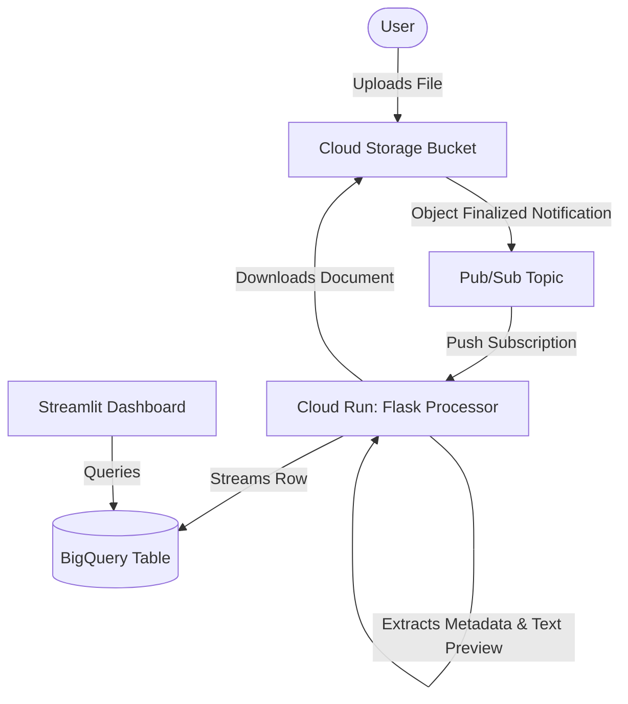

# Serverless Event-Driven Document Processing Pipeline
##fully created by google Antigravity as a practice of using google AI Agent system.##


A serverless, event-driven document processing and metadata extraction pipeline built on Google Cloud Platform (GCP). 

Whenever a user uploads a document to a Cloud Storage bucket, an event triggers simulated OCR and metadata extraction inside a Python Flask service running on Cloud Run. The extracted metadata is then streamed into a BigQuery table, which is visualized in an interactive, theme-aware Streamlit dashboard.

---

## Architecture Flow



1. **Ingestion**: A user uploads a document (e.g., `.txt`, `.pdf`, `.png`) to the Cloud Storage upload bucket.
2. **Trigger**: The file upload triggers a native Cloud Storage Pub/Sub notification, publishing an `OBJECT_FINALIZE` event message to a Pub/Sub topic.
3. **Processing (Cloud Run)**: A Pub/Sub Push subscription forwards the message to the Python Flask microservice on Cloud Run.
4. **Metadata Extraction (OCR)**: The Flask service downloads the document from Cloud Storage. For plain text files (`.txt`), it extracts the actual text, word count, and relevant tags. For other formats (e.g., PDF, images), it runs a simulated OCR extraction to mock the metadata.
5. **Streaming Storage (BigQuery)**: The service streams the extracted metadata (filename, bucket, size, content_type, word_count, tags, OCR text preview, and timestamp) directly into a BigQuery table using the legacy Streaming API (`insert_rows_json`).
6. **Analytics (Streamlit)**: An interactive Streamlit dashboard queries BigQuery, display KPIs, and lets users search files and filter metadata by tags.

---

## Tech Stack

* **Google Cloud Platform (GCP)**:
  * **Cloud Storage**: Object storage for document uploads.
  * **Cloud Pub/Sub**: Message broker for event notifications.
  * **Cloud Run**: Containerized Python microservice hosting the processor.
  * **Cloud Build**: Serverless container compilation and registry.
  * **BigQuery**: Serverless data warehouse storing metadata logs.
* **Backend Framework**: Flask + Gunicorn (Python 3.11)
* **Frontend Visualization**: Streamlit + Plotly (Python)
* **Infrastructure Provisioning**: Google Cloud SDK CLI (`gcloud` / `bq` shell script)

---

## Project Structure

```text
├── Dockerfile                  # Container instructions for Cloud Run
├── README.md                   # Project documentation
├── dashboard.py                # Streamlit dashboard application
├── deploy.sh                   # Step-by-step gcloud resource setup script
├── main.py                     # Flask Pub/Sub processor service
├── requirements.txt            # Python dependencies (Flask, Pandas, GCP clients)
├── schema.json                 # BigQuery metadata table schema definition
├── test_cloud.py               # Cloud integration verification script
└── test_local.py               # Local mock unit tests
```

---

## How to Deploy

The project includes a step-by-step `deploy.sh` script to provision all resources in your GCP project.

### Prerequisites

* Google Cloud SDK (`gcloud` and `bq` command-line tools) installed and authenticated.
* A GCP project created and active in your `gcloud` configuration.

### Deployment Steps

1. Clone or copy the project files.
2. Open a bash-compatible terminal (Git Bash, WSL, Cloud Shell, Linux, or macOS).
3. Set your target project ID and execute the deployment script:
   ```bash
   export PROJECT_ID="your-gcp-project-id"
   ./deploy.sh
   ```

The script will:
- Enable the required APIs.
- Create the Cloud Storage bucket `gs://<PROJECT_ID>-documents`.
- Set up the Pub/Sub topic, storage notifications, and push subscription.
- Create the BigQuery dataset `document_processing` and metadata table.
- Build the container image using Cloud Build and deploy it to Cloud Run.

---

## How to Run the Cloud Integration Test

Once deployed, you can verify the end-to-end functionality using the cloud integration test:

1. Authenticate your terminal for Application Default Credentials (ADC):
   ```bash
   gcloud auth application-default login
   ```
2. Run the integration test script:
   ```bash
   export BUCKET_NAME="${PROJECT_ID}-documents"
   python test_cloud.py
   ```

The script will upload a text file to your GCS bucket, sleep for 10 seconds to allow event processing, query BigQuery, and display the ingested metadata.

---

## How to Run the Streamlit Dashboard

You can run the dashboard locally to view ingestion statistics, KPIs, and search/filter documents.

1. Navigate to the project directory and activate the virtual environment:
   ```bash
   # On Windows (PowerShell)
   .venv\Scripts\Activate.ps1

   # On Linux / macOS / Git Bash (bash)
   source .venv/bin/activate
   ```
2. Install the requirements (if not already done):
   ```bash
   pip install -r requirements.txt
   ```
3. Launch the Streamlit dashboard:
   ```bash
   streamlit run dashboard.py
   ```

The dashboard will open automatically in your browser at `http://localhost:8501`. If BigQuery is empty or credentials are not configured, it will fall back to showing simulated placeholder records for preview.

---

## Security Note

For ease of demonstration and initial setup, the Cloud Run service is deployed with **unauthenticated public access** allowed (`--allow-unauthenticated`), and the Pub/Sub subscription sends requests directly.

In a production environment:
1. Turn off public access on Cloud Run (`--no-allow-unauthenticated`).
2. Configure the Pub/Sub Push Subscription with a dedicated service account and OIDC token routing.
3. Grant that service account the `roles/run.invoker` permission on Cloud Run to secure the endpoint.

---

## Cost Cleanup Note

To avoid ongoing charges on your GCP account, clean up the resources when they are no longer needed:

```bash
# Delete the Pub/Sub subscription
gcloud pubsub subscriptions delete document-uploads-sub

# Delete the Pub/Sub topic
gcloud pubsub topics delete document-uploads

# Remove the GCS bucket and all its contents
gsutil rm -r gs://$PROJECT_ID-documents

# Delete the Cloud Run service
gcloud run services delete document-processor --region=us-central1

# Delete the BigQuery dataset (and metadata table)
bq rm -r -f -d $PROJECT_ID:document_processing

# Delete the Artifact Registry repository
gcloud artifacts repositories delete document-pipeline-repo --location=us-central1
```
